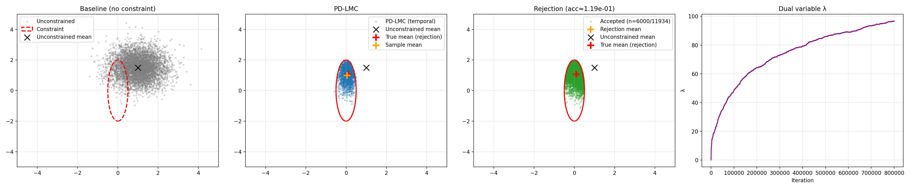

# Primal-Dual Langevin Monte Carlo in PyTorch + Training-Free Constrained Diffusion

This repository contains my PyTorch implementation of **Algorithm 1** from:

**Constrained Sampling with Primal-Dual Langevin Monte Carlo**  
NeurIPS 2024  
Paper: *Constrained Sampling with Primal-Dual Langevin Monte Carlo*

The project has two parts:

1. **Exercise 1**: reproduce the 2D constrained Gaussian experiment in PyTorch, replacing the unit ball by an **axis-aligned ellipsoid**.
2. **Bonus**: propose and test a **training-free adaptation** of the primal-dual idea for diffusion models, without retraining.

---

## Repository structure

```text
.
├── Exercice_1.ipynb
├── Bonus.ipynb
├── experiment_01_ellipsoid.png
├── requirements.txt
├── PD_LMC/
│   ├── constraint.py
│   ├── density.py
│   └── pd_lmc.py
└── PD_LMC_diffusion/
    ├── Controllable_generation_MNIST/
    │   ├── controllable_generation_mnist.py
    │   └── mnist_classifier.pt
    └── Controllable_generation_CelebA/
        └── controllable_generation_celebahq.py
```

---

## Part 1 — PyTorch implementation of Algorithm 1

The first part implements a **primal-dual Langevin Monte Carlo (PD-LMC)** sampler for a 2D Gaussian target under an ellipsoidal support constraint.

### Target distribution

I consider a 2D Gaussian target
```math
\pi(x) \propto \exp(-f(x))
```
with quadratic energy defined in `PD_LMC/density.py`.

### Constraint

Instead of the unit ball used in the original example, I impose the axis-aligned ellipsoid
```math
\left(\frac{x_1-c_1}{r_x}\right)^2 + \left(\frac{x_2-c_2}{r_y}\right)^2 \le 1,
```
implemented in `PD_LMC/constraint.py`.

### PD-LMC update

At each iteration, the sampler uses the constrained energy
```math
U(x,\lambda) = f(x) + \lambda\, g(x),
```
with
```math
g(x) = \mathrm{ReLU}(h(x)) - \varepsilon,
```
where $h(x)\le 0$ defines feasibility and $\varepsilon$ is a small slack.

The implementation in `PD_LMC/pd_lmc.py` alternates:

- a **primal Langevin step** on $x$,
- a **projected dual ascent step** on $\lambda$,
- storage of temporal samples and of the dual trace.

### Reference comparison

To validate the implementation, I compare:

- the unconstrained Gaussian baseline,
- the PD-LMC temporal samples,
- rejection sampling used as a reference estimator for the constrained target.

The main output figure is:



### Comments

This experiment reproduces the spirit of the original 2D example while changing the geometry of the feasible set from a unit ball to an ellipsoid, as requested. In practice, the step sizes had to be tuned to obtain a reasonable estimate of the constrained mean.

---

## Part 2 — Bonus: training-free constrained diffusion

The bonus asks for an adaptation of the primal-dual idea to a diffusion model **without retraining**.

My approach is the following:

- keep a pretrained unconditional diffusion model fixed,
- reconstruct an estimate of the clean sample $\hat x_0(x_t,t)$ at each reverse step,
- evaluate the constraint on $\hat x_0$, not on the noisy state $x_t$,
- update a dual variable $\lambda$ online,
- backpropagate the penalty through $\hat x_0(x_t,t)$ and through the denoiser,
- correct the reverse step with a primal-dual guidance term.

In other words, this is a **training-free primal-dual guidance strategy inspired by Algorithm 1**.

### Generic form

At reverse time $t$, I use the clean estimate
```math
\hat x_0 = \hat x_0(x_t,t),
```
define a constraint violation $h(\hat x_0)$, update
```math
\lambda \leftarrow [\lambda + \eta_\lambda h(\hat x_0)]_+,
```
and apply a correction of the form
```math
x_{t-1}
=
\text{DDPMstep}(x_t)
-
\eta_x \nabla_{x_t}\big(\lambda\, h(\hat x_0(x_t,t))\big).
```

This preserves the original pretrained model and only modifies sampling.

---

## Bonus application 1 — Conditional generation on MNIST

I apply this idea to a pretrained unconditional DDPM on MNIST.

### Goal

Generate a digit from a target class **without retraining** the diffusion model.

### Constraint

A pretrained classifier is used to define the constraint on the estimated clean image:
```math
h(\hat x_0) = \tau - p_\phi(y=c \mid \hat x_0),
```
so the goal is to enforce
```math
p_\phi(y=c \mid \hat x_0) \ge \tau.
```

### Implementation

Relevant file:
- `PD_LMC_diffusion/Controllable_generation_MNIST/controllable_generation_mnist.py`

The notebook compares:

- a baseline unconditional sample,
- a guided sample from the **same initial noise**,
- the evolution of the target-class probability,
- the evolution of the dual variable $\lambda$.

### What this shows

This experiment provides a simple proof of concept that a pretrained unconditional DDPM can be turned into a constrained generator at inference time using a primal-dual correction.

---

## Bonus application 2 — Brightness control on CelebA-HQ

I also test the same idea on a pretrained unconditional DDPM for CelebA-HQ.

### Goal

Increase image brightness while keeping the generated face close to a reference baseline sample.

### Constraints

Two constraints are used simultaneously:

1. **brightness constraint**
   ```math
   h_{\text{light}}(\hat x_0)=b^\star-\mathrm{mean}(\hat x_0),
   ```
2. **structure constraint**
   ```math
   h_{\text{struct}}(\hat x_0)=\mathrm{MSE}(\hat x_0, x_{\text{ref}})-\varepsilon.
   ```

This leads to two dual variables:
```math
\lambda_{\text{light}}, \lambda_{\text{struct}}.
```

### Implementation

Relevant file:
- `PD_LMC_diffusion/Controllable_generation_CelebA/controllable_generation_celebahq.py`

This experiment is more difficult to stabilize than MNIST, but it illustrates how the same primal-dual mechanism can naturally handle **multiple simultaneous constraints**.

---

## Main takeaway

The key idea of this repository is:

> constraints can be imposed at sampling time, without retraining, by combining a pretrained generative model with an online primal-dual correction.

For diffusion models, the practical strategy used here is to impose constraints on the **estimated clean sample** $\hat x_0$, then propagate the correction back to the current noisy state $x_t$.

---

## Limitations

This bonus adaptation is meant as a **practical and research-oriented extension**, not as a full proof of exact equivalence with the original continuous-time constrained target.

In particular:

- the constraint is evaluated on $\hat x_0(x_t,t)$, which is a plug-in estimate of the clean image;
- the resulting method should therefore be interpreted as a **training-free primal-dual guidance inspired by PD-LMC**;
- the method is local in time and may require careful tuning of primal and dual step sizes.

Still, the experiments suggest that the primal-dual viewpoint is a useful and flexible way to control pretrained diffusion samplers.

---

## Installation

Create an environment and install the dependencies:

```bash
pip install -r requirements.txt
```

---

## How to run

### Exercise 1
Open and run:

```bash
jupyter notebook Exercice_1.ipynb
```

### Bonus experiments
Open and run:

```bash
jupyter notebook Bonus.ipynb
```

Notes:
- the MNIST part can train/load a small classifier and then run the guided DDPM experiment;
- the CelebA-HQ part downloads a pretrained diffusion model from Hugging Face and is heavier to run.

---

## Notes

- The implementation is intentionally simple and explicit rather than heavily optimized.
- The bonus should be read as a **proof of concept** showing how the primal-dual idea may be adapted to diffusion-based generation without retraining.
